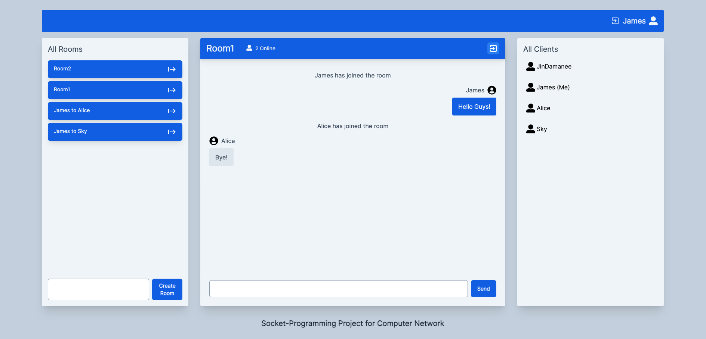

# Socket Chat App

Academic project for the course "Computer Network I" about a chat application using websockets.



## Installation

1. Clone the project

```bash
    git clone https://github.com/JinDamanee2544/socket-chat-app
```

2.  Copy `.env.template` to `.env` or by using this command

```bash
    cp .env.template .env
```

3. Assign your backend's url to `VITE_BACKEND_BASE_URL`

4. Start the development server

```bash
    pnpm install
    pnpm dev
```

5. If you want to build the project and start up production server (Optional)

```bash
    pnpm build
    pnpm start
```

## Stack

### Frontend

- TypeScript
- React
- Vite
- Tailwind
- PrelineUI

### Backend

- Golang

[Go Check the Backend's Repo](https://github.com/TikhampornSky/WebSocket)
